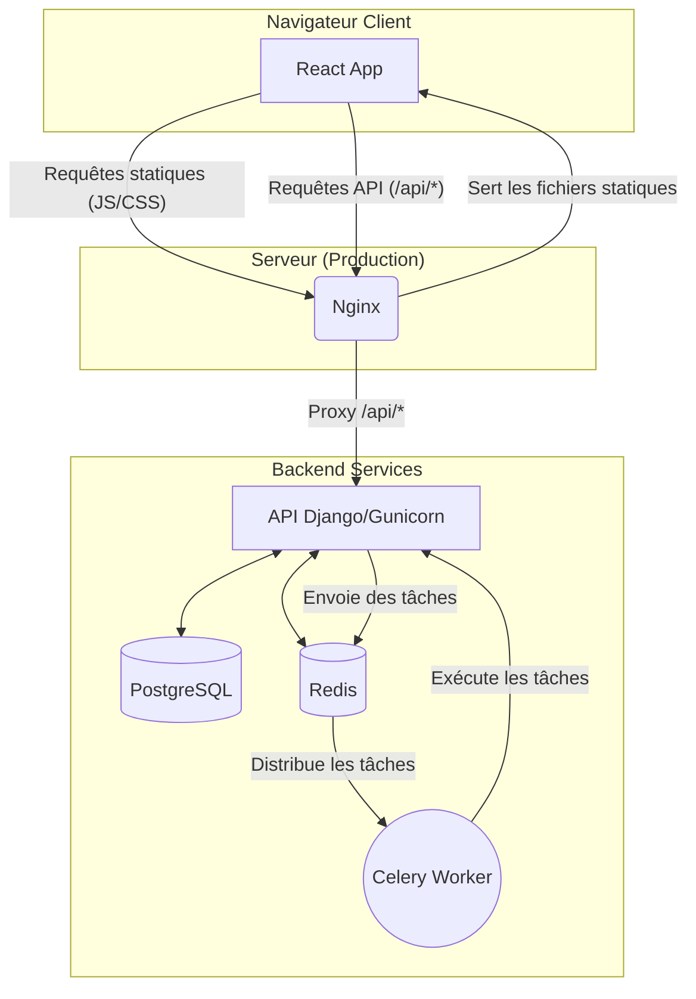

# **Taste Match 🎵🎬📚**

**Taste Match est le jeu social qui transforme vos films, musiques et livres préférés en un défi amusant et révélateur avec vos amis. Réglez les débats, découvrez des pépites cachées et découvrez qui est votre véritable âme-sœur culturelle.**

Ce projet a pour ambition de créer une application sociale engageante où l'interaction principale est un "défi de goût" ludique et direct entre utilisateurs. L'objectif n'est pas seulement de cataloguer des œuvres culturelles, mais de transformer ces catalogues en un jeu interactif, un véritable "démarreur de conversation".

## **📖 Table des matières**

* [🎯 À propos du projet](#-à-propos-du-projet)
  * [Proposition de valeur unique](#proposition-de-valeur-unique)
  * [Audience cible](#audience-cible)
* [✨ Fonctionnalités clés](#-fonctionnalités-clés)
* [🛠️ Stack technologique](#-stack-technologique)
* [🏗️ Architecture](#-architecture)
* [🚀 Feuille de route du projet](#-feuille-de-route-du-projet)
* [🔒 Sécurité (Approche DevSecOps)](#-sécurité-approche-devsecops)
* [🏁 Démarrage rapide](#-démarrage-rapide)
* [📊 Indicateurs clés de performance (KPIs)](#-indicateurs-clés-de-performance-kpis)
* [⚖️ Légalité et conformité](#-légalité-et-conformité)
* [🤝 Contribution](#-contribution)
* [📄 Licence](#-licence)
* [🙏 Remerciements](#-remerciements)

## **🎯 À propos du projet**

Taste Match est né d'un constat simple : les plateformes culturelles existantes comme Letterboxd ou Goodreads sont excellentes pour le catalogage passif, mais manquent d'interaction sociale directe, synchrone et ludique. Taste Match comble cette lacune en ne se contentant pas de permettre la comparaison, mais en la **provoquant** à travers un défi.

Le cœur de l'expérience est le moment de la "révélation" du score de compatibilité, conçu pour susciter une réaction émotionnelle et lancer une conversation : la surprise, la validation ou le débat amical.

### **Proposition de valeur unique**

Taste Match se différencie du paysage concurrentiel sur plusieurs points clés :

* **Actif vs. Passif :** L'application crée des défis interactifs plutôt que de simplement afficher des listes.
* **Ludique vs. Archivage :** C'est un jeu, pas une simple base de données. L'objectif est le "match".
* **Révélation Synchrone vs. Navigation Asynchrone :** La magie réside dans la découverte simultanée et partagée des résultats.

### **Audience cible**

La conception s'adresse à plusieurs types d'utilisateurs :

1. **Le Couple Décontracté (Alex & Ben) :** Cherche des moyens amusants de se connecter et de décider quoi regarder ou écouter.
2. **La Cinéphile Passionnée (Chloé) :** Utilise l'application pour démontrer son expertise et défier les membres de son ciné-club avec des listes pointues.
3. **L'Organisatrice Sociale (Maria) :** Gère des clubs (lecture, jeux) et utilise l'application pour engager sa communauté et prendre des décisions de groupe.

## **✨ Fonctionnalités clés**

* **Parcours d'intégration optimisé :** Un processus d'inscription rapide pour guider l'utilisateur vers son premier "match" le plus vite possible, le "moment Aha!" de l'application.
* **Création de listes expressives :** Les listes sont l'unité de base de la créativité de l'utilisateur. Des fonctionnalités comme les listes collaboratives et les modèles sont prévues.
* **Mécanique de "Match" gamifiée :** Un algorithme calcule un score de compatibilité, enrichi par des éléments de jeu comme des séries (streaks), des badges/succès et des classements entre amis pour encourager l'engagement.
* **Défis de groupe :** Un utilisateur peut défier un groupe entier, avec un écran de résultats affichant le score moyen et les classements individuels.
* **Écran de résultats viral :** Conçu pour être partagé ! Il inclut non seulement le score, mais aussi des visualisations de données (diagramme de Venn) et des aperçus qualitatifs amusants. Il comporte un double appel à l'action crucial : **"Partager votre résultat"** et **"Le défier en retour!"** pour créer une boucle virale.

## **🛠️ Stack technologique**

La stack est choisie pour une architecture découplée, moderne et scalable, prête pour une application web interactive.

| Composant | Technologie | Justification |
| :--- | :--- | :--- |
| **Framework Backend** | **Django + Django REST Framework** | Fournit une API REST robuste et sécurisée. DRF est le standard pour construire des API avec Django. |
| **Framework Frontend** | **React** | Crée une interface utilisateur riche, rapide et moderne (Single-Page Application), totalement découplée du backend. |
| **Base de Données** | **PostgreSQL** | Indispensable pour une application sociale, gère une forte concurrence et assure la parité dev/prod. |
| **Mise en Cache** | **Redis** | Essentiel pour améliorer les performances et respecter les limites de débit des APIs externes. |
| **File de Tâches** | **Celery** | Permet d'exécuter des tâches longues en arrière-plan pour une expérience utilisateur fluide. |
| **Déploiement** | **Docker + Nginx** | Docker conteneurise l'environnement. Nginx sert le frontend React et agit comme reverse proxy pour l'API, une architecture de production standard. |

## **🏗️ Architecture**

L'architecture est découplée (headless), avec un frontend React et un backend Django qui communiquent via une API REST.



*   **Frontend (React) :** Une application autonome qui gère toute la logique de l'interface utilisateur.
*   **Backend (Django API) :** Ne se soucie pas de l'affichage. Il expose des "points d'accès" (endpoints) sécurisés (ex: `/api/users/`, `/api/lists/`) que le frontend peut interroger.
*   **Nginx :** Le portier. Il sert l'application React à l'utilisateur et redirige intelligemment les appels API vers Django.

## **🚀 Feuille de route du projet**

Le développement est séquencé pour livrer de la valeur rapidement tout en construisant une base solide.

### **Sprint 0 : Fondations professionnelles**

L'objectif est de mettre en place un environnement de développement stable et reproductible avec Docker, d'initialiser le projet Django et de sécuriser les clés d'API.

### **Sprints MVP : Développement des fonctionnalités de base**

#### **1. Gestion des utilisateurs**
*   **Backend (API) :**
    *   Mettre en place l'authentification par token (JWT).
    *   Créer les endpoints `/api/auth/register/`, `/api/auth/login/`, `/api/auth/logout/`.
    *   Créer l'endpoint `/api/users/me/` pour récupérer les infos de l'utilisateur connecté.
*   **Frontend (UI) :**
    *   Créer les pages et formulaires d'inscription et de connexion.
    *   Mettre en place la logique de stockage sécurisé des tokens.
    *   Créer un "hook" d'authentification pour gérer l'état de connexion global.
    *   Protéger les routes qui nécessitent d'être connecté.

#### **2. Création de listes**
*   **Backend (API) :**
    *   Créer les endpoints CRUD pour les listes (`/api/lists/`).
    *   Implémenter la logique d'ajout/suppression d'éléments culturels via les APIs externes.
*   **Frontend (UI) :**
    *   Créer l'interface de création et de gestion des listes.
    *   Intégrer la recherche d'éléments (films, musiques, livres) via l'API backend.

#### **3. Mécanique de match**
*   **Backend (API) :**
    *   Créer l'endpoint pour initier un défi (`/api/matches/`).
    *   Implémenter la logique de calcul du score de compatibilité.
*   **Frontend (UI) :**
    *   Créer l'interface pour envoyer un défi à un autre utilisateur.

#### **4. Résultats et partage**
*   **Backend (API) :**
    *   Créer l'endpoint pour récupérer les résultats d'un match (`/api/matches/<id>/`).
*   **Frontend (UI) :**
    *   Créer l'écran de résultats viral avec le score et les visualisations.
    *   Implémenter le bouton de partage.

### **Phase 2 : Communauté et engagement (Mois 1-3 post-lancement)**

*   Profils utilisateurs publics
*   Fil d'activité global
*   Commentaires et réactions
*   Groupes persistants (clubs)

### **Phase 3 : Découverte et Monétisation (Mois 4-9 post-lancement)**

*   Moteur de recommandation simple
*   Niveau "Pro" (Freemium) avec statistiques avancées
*   Marketing d'affiliation sur les œuvres présentées

## **🔒 Sécurité (Approche DevSecOps)**

La sécurité est intégrée dans chaque sprint, en se concentrant sur les risques de l'architecture API + SPA et le **Top 10 de l'OWASP**.

| Domaine | Risques pertinents | Actions de sécurité |
| :--- | :--- | :--- |
| **Authentification** | Vol de token, Rupture de contrôle d'accès | Utilisation de tokens JWT avec une durée de vie courte et une politique de rafraîchissement (refresh tokens). Stockage des tokens côté client dans des `HttpOnly cookies` pour prévenir les attaques XSS. |
| **API (Endpoints)** | Injection (SQL), Exposition de données, Accès non autorisé | Validation systématique de toutes les données entrantes avec les `serializers` de DRF. Permissions granulaires sur chaque endpoint. Limitation de débit (throttling) pour prévenir les abus. |
| **Communication** | Interception (Man-in-the-Middle) | Utilisation de HTTPS en production. Configuration de `django-cors-headers` pour n'autoriser que le domaine du frontend à communiquer avec l'API. |
| **Dépendances** | Composants vulnérables et obsolètes | Scan automatisé des dépendances (ex: `pip-audit` pour le backend, `npm audit` pour le frontend) intégré dans le CI/CD. |

## **🏁 Démarrage rapide**

Pour lancer l'environnement de développement local, assurez-vous d'avoir **Git** et **Docker** (avec Docker Compose) installés.

### **1. Structure du projet**

Le projet est divisé en deux dossiers principaux :
*   `backend/`: Contient l'application Django (l'API).
*   `frontend/`: Contient l'application React (l'interface utilisateur).

### **2. Configuration initiale**

1.  **Clonez le dépôt :**
    ```bash
    git clone https://github.com/ybdn/taste-match.git
    cd taste-match
    ```

2.  **Configurez les variables d'environnement du Backend :**
    ```bash
    cd backend
    cp .env.example .env
    ```
    Ouvrez `backend/.env` et remplissez les clés API (TMDb, Spotify, etc.) et les secrets.

3.  **Configurez les variables d'environnement du Frontend :**
    ```bash
    cd ../frontend
    cp .env.example .env
    ```
    Ouvrez `frontend/.env` et assurez-vous que la variable `VITE_API_BASE_URL` pointe vers l'URL de votre API backend (par défaut `http://localhost:8000/api`).

### **3. Lancement de l'application**

1.  **Lancez tous les services avec Docker Compose :**
    À la racine du projet, exécutez :
    ```bash
    docker-compose up --build
    ```
    Cette commande va construire et démarrer les conteneurs pour le frontend, le backend, la base de données, etc.

2.  **Appliquez les migrations de la base de données :**
    Dans un **autre terminal**, une fois les conteneurs lancés, exécutez :
    ```bash
    docker-compose exec backend python manage.py migrate
    ```

### **4. Accès à l'application**

🎉 Votre environnement est prêt !
*   **Application Frontend :** [http://localhost:3000](http://localhost:3000)
*   **API Backend :** [http://localhost:8000](http://localhost:8000)

## **📊 Indicateurs clés de performance (KPIs)**

Le succès du projet sera mesuré à l'aide des indicateurs suivants :

* **Engagement :**
  * Utilisateurs Actifs Quotidiens/Mensuels (DAU/MAU)
  * Taux de complétion des matchs
* **Rétention :**
  * Rétention à J1, J7, J30 (le plus critique)
  * Taux de désabonnement (Churn Rate)
* **Viralité :**
  * Taux de partage des résultats
  * Coefficient viral (k-factor)

## **⚖️ Légalité et conformité**

Une attention particulière est portée à la conformité légale dès le début du projet.

* **Documents légaux :** Des Conditions d'Utilisation et une Politique de Confidentialité claires seront rédigées pour protéger l'utilisateur et le développeur.
* **Conformité RGPD :** L'application est développée en tenant compte des principes du RGPD, notamment la minimisation des données et le "droit à l'oubli", qui sera une fonctionnalité technique permettant aux utilisateurs de supprimer leurs données.
* **Conditions des APIs :** Les exigences d'attribution des fournisseurs de données (comme le logo TMDb) seront respectées dans l'interface utilisateur.

## **🤝 Contribution**

Les contributions sont ce qui fait de la communauté open source un endroit extraordinaire pour apprendre, inspirer et créer. Toutes les contributions que vous apporterez sont **grandement appréciées**.

Si vous avez une suggestion pour améliorer ce projet, veuillez forker le dépôt et créer une pull request. Vous pouvez aussi simplement ouvrir une issue avec le tag "enhancement".

1. Forkez le projet
2. Créez votre branche de fonctionnalité (`git checkout -b feature/AmazingFeature`)
3. Commitez vos changements (`git commit -m 'Add some AmazingFeature'`)
4. Poussez vers la branche (`git push origin feature/AmazingFeature`)
5. Ouvrez une Pull Request

## **📄 Licence**

Ce projet est distribué sous la Licence MIT. Voir le fichier LICENSE pour plus d'informations.

## **🙏 Remerciements**

Ce projet n'existerait pas sans les données fantastiques fournies par les APIs suivantes :

* [The Movie Database (TMDb)](https://www.themoviedb.org/)
* [Spotify for Developers](https://developer.spotify.com/)
* [Google Books APIs](https://developers.google.com/books)
* [IGDB API](https://api-docs.igdb.com/)
